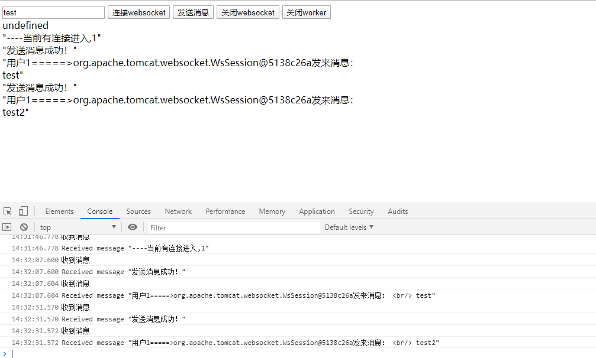
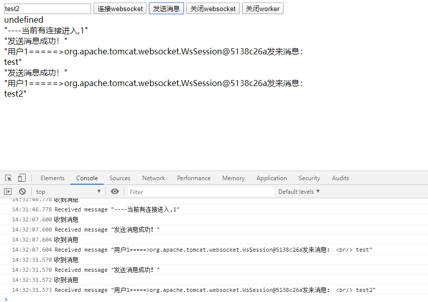
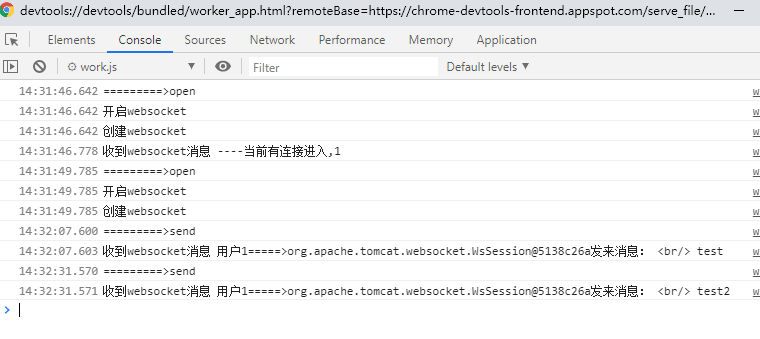

## 浏览器多tab消息共享

### 需求

多个浏览器页面启动，需要使用同一个websocket在每个tab中发送消息和收取消息。

### 技术栈

> 前端：SharedWorker + Websocket

> 服务端：websocket

### SharedWorker
>SharedWorker接口代表一种特定类型的工作者，可以从几个浏览上下文中访问，例如几个窗口，内联框架或甚至工作者。它们实现一个不同于专门工作者的接口

示例：

**main.js**

```javascript
<script>
    var worker;
    console.log("支持sharedworker")
    worker = new SharedWorker('work.js');

    worker.port.onmessage = function(event) {
        console.log("收到消息");
    };
    $("#send").on('click', function () {
        worker.port.postMessage({method: "send", data: $('#txt').val()});
    });
</script>
```
**work.js**

```javascript
onconnect = function (e) {
    // 通过 e.ports 拿到 port
    var port = e.ports[0];
    portList.push(port);

    // port.onmessage 监听父线程的消息
    port.onmessage = function (event) {
        var workerResult = event.data.data;
        portList.map(item=>{            
            // item!=port&&item.postMessage(workerResult);  /**不发给自己 */
            item.postMessage(workerResult);                 /**发给自己 */
        });
    }
}
```

### 预览





### chrome中查看sharedworker
> chrome中输入：chrome://inspect/#workers



### github地址

https://github.com/hirCodd/Websocket_SharedWorker

### 浏览器支持

Chrome(4+)/Edge(12+)/Firefox(79)/Android(4.4+)
